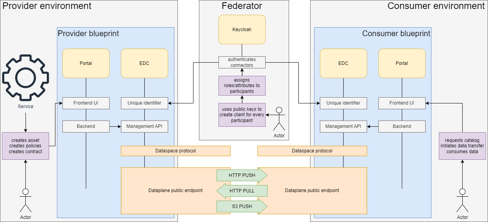

# Connector Example
This repository contains an example deployment of 2 EDC instances with an UI, showcasing data transfer between a provider and a consumer using OAuth2-based Identification.

## How to run

> [!IMPORTANT]
> This is the development environment which does not host the connectors themselves.

Setting up the development environment includes four steps: cloning the repositories, setting up the project in your IDE (this guide describes IntelliJ to set up), starting the components, and initializing the project.

1. Clone this repository to the directory `connector-example` and clone the [connector](https://github.com/wetransform/connector) repository to `connector`.
2. Open the connector with your IDE and add two **Gradle** Run/Debug Configurations with their respective environments:
   1. Name: `edc-provider`, Run: `:launchers:connector:runShadow --info`, Gradle project: `connector`, Environment variables:
      ```
      EDC_AGENT_IDENTITY_KEY=participant_id;EDC_DATAPLANE_API_PUBLIC_BASEURL=http://host.docker.internal:19291/public;EDC_DATASOURCE_DEFAULT_PASSWORD=postgres;EDC_DATASOURCE_DEFAULT_URL=jdbc:postgresql://host.docker.internal:5432/dataspace?currentSchema=provider;EDC_DATASOURCE_DEFAULT_USER=user;EDC_DSP_CALLBACK_ADDRESS=http://host.docker.internal:19194/protocol;EDC_NODES_FILE_PATH=/Users/moritz/connector-example/edc/nodes.properties;EDC_OAUTH_CERTIFICATE_ALIAS=public-key;EDC_OAUTH_CLIENT_ID=edc-provider;EDC_OAUTH_PRIVATE_KEY_ALIAS=private-key;EDC_OAUTH_PROVIDER_AUDIENCE=http://host.docker.internal:8080/realms/dataspace;EDC_OAUTH_PROVIDER_JWKS_URL=http://host.docker.internal:8080/realms/dataspace/protocol/openid-connect/certs;EDC_OAUTH_TOKEN_URL=http://host.docker.internal:8080/realms/dataspace/protocol/openid-connect/token;EDC_OAUTH_VALIDATION_ISSUED_AT_LEEWAY=5;EDC_OAUTH_VALIDATION_NBF_LEEWAY=20;EDC_PARTICIPANT_ID=company1;EDC_PUBLIC_KEY_ALIAS=public-key;EDC_SQL_SCHEMA_AUTOCREATE=true;EDC_TRANSFER_PROXY_TOKEN_SIGNER_PRIVATEKEY_ALIAS=private-key;EDC_TRANSFER_PROXY_TOKEN_VERIFIER_PUBLICKEY_ALIAS=public-key;EDC_VAULT_FILE_PATH=/Users/moritz/connector-example/edc/vault.properties;LOG_LEVEL=info;WEB_HTTP_CATALOG_PATH=/catalog;WEB_HTTP_CATALOG_PORT=19199;WEB_HTTP_CONTROL_PATH=/control;WEB_HTTP_CONTROL_PORT=19192;WEB_HTTP_MANAGEMENT_PATH=/management;WEB_HTTP_MANAGEMENT_PORT=19193;WEB_HTTP_PATH=/api;WEB_HTTP_PORT=19191;WEB_HTTP_PROTOCOL_PATH=/protocol;WEB_HTTP_PROTOCOL_PORT=19194;WEB_HTTP_PUBLIC_PATH=/public;WEB_HTTP_PUBLIC_PORT=19291
      ```
   2. Name: `edc-consumer`, Run: `:launchers:connector:runShadow --info`, Gradle project: `connector`, Environment variables:
      ```
      EDC_AGENT_IDENTITY_KEY=participant_id;EDC_DATAPLANE_API_PUBLIC_BASEURL=http://host.docker.internal:29291/public;EDC_DATASOURCE_DEFAULT_PASSWORD=postgres;EDC_DATASOURCE_DEFAULT_URL=jdbc:postgresql://host.docker.internal:5432/dataspace?currentSchema=consumer;EDC_DATASOURCE_DEFAULT_USER=user;EDC_DSP_CALLBACK_ADDRESS=http://host.docker.internal:29194/protocol;EDC_NODES_FILE_PATH=/Users/moritz/connector-example/edc/nodes.properties;EDC_OAUTH_CERTIFICATE_ALIAS=public-key;EDC_OAUTH_CLIENT_ID=edc-consumer;EDC_OAUTH_PRIVATE_KEY_ALIAS=private-key;EDC_OAUTH_PROVIDER_AUDIENCE=http://host.docker.internal:8080/realms/dataspace;EDC_OAUTH_PROVIDER_JWKS_URL=http://host.docker.internal:8080/realms/dataspace/protocol/openid-connect/certs;EDC_OAUTH_TOKEN_URL=http://host.docker.internal:8080/realms/dataspace/protocol/openid-connect/token;EDC_OAUTH_VALIDATION_ISSUED_AT_LEEWAY=5;EDC_OAUTH_VALIDATION_NBF_LEEWAY=20;EDC_PARTICIPANT_ID=company2;EDC_PUBLIC_KEY_ALIAS=public-key;EDC_SQL_SCHEMA_AUTOCREATE=true;EDC_TRANSFER_PROXY_TOKEN_SIGNER_PRIVATEKEY_ALIAS=private-key;EDC_TRANSFER_PROXY_TOKEN_VERIFIER_PUBLICKEY_ALIAS=public-key;EDC_VAULT_FILE_PATH=/Users/moritz/connector-example/edc/vault.properties;LOG_LEVEL=info;WEB_HTTP_CATALOG_PATH=/catalog;WEB_HTTP_CATALOG_PORT=29199;WEB_HTTP_CONTROL_PATH=/control;WEB_HTTP_CONTROL_PORT=29192;WEB_HTTP_MANAGEMENT_PATH=/management;WEB_HTTP_MANAGEMENT_PORT=29193;WEB_HTTP_PATH=/api;WEB_HTTP_PORT=29191;WEB_HTTP_PROTOCOL_PATH=/protocol;WEB_HTTP_PROTOCOL_PORT=29194;WEB_HTTP_PUBLIC_PATH=/public;WEB_HTTP_PUBLIC_PORT=29291
      ```
3. In `connector-example`, run `docker compose up -d`. After the services are started up, start the connectors. Therefore run both, `edc-provider` and `edc-consumer` in your IDE in parallel.
4. To add the initial data sets to your setup, run in the `connector-example`-directory following: `EDC_BASE_URL=http://host.docker.internal:19193 ./initialization/init.sh` (This step is only necessary at the initial installation.)

Ressources available at:
- EDC provider API: [http://localhost:19191/api](http://localhost:19191/api)
- EDC consumer API: [http://localhost:29191/api](http://localhost:29191/api)
- Portal provider: [http://localhost:8085](http://localhost:8085)
- Portal consumer: [http://localhost:8086](http://localhost:8086)
- Keycloak: [http://localhost:8080](http://localhost:8080)
- Datasets Nginx: [http://localhost:8088](http://localhost:8088)

### Man in the middle

To track the traffic between the components for protocol debugging, there is also a mitm configuration available.
Therefore, follow theses steps (assuming you alredy cloned the repositories):

1. Open the connector with your IDE and add two **Gradle** Run/Debug Configurations with their respective environments:
   1. Name: `edc-provider (mitm)`, Run: `:launchers:connector:runShadow --info`, Gradle project: `connector`, Environment variables:
      ```
      EDC_AGENT_IDENTITY_KEY=participant_id;EDC_DATAPLANE_API_PUBLIC_BASEURL=http://host.docker.internal:39291/public;EDC_DATASOURCE_DEFAULT_PASSWORD=postgres;EDC_DATASOURCE_DEFAULT_URL=jdbc:postgresql://host.docker.internal:5432/dataspace?currentSchema=provider;EDC_DATASOURCE_DEFAULT_USER=user;EDC_DSP_CALLBACK_ADDRESS=http://host.docker.internal:39194/protocol;EDC_NODES_FILE_PATH=/Users/moritz/connector-example/edc/mitm-nodes.properties;EDC_OAUTH_CERTIFICATE_ALIAS=public-key;EDC_OAUTH_CLIENT_ID=edc-provider;EDC_OAUTH_PRIVATE_KEY_ALIAS=private-key;EDC_OAUTH_PROVIDER_AUDIENCE=http://host.docker.internal:8080/realms/dataspace;EDC_OAUTH_PROVIDER_JWKS_URL=http://host.docker.internal:8080/realms/dataspace/protocol/openid-connect/certs;EDC_OAUTH_TOKEN_URL=http://host.docker.internal:8080/realms/dataspace/protocol/openid-connect/token;EDC_OAUTH_VALIDATION_ISSUED_AT_LEEWAY=5;EDC_OAUTH_VALIDATION_NBF_LEEWAY=20;EDC_PARTICIPANT_ID=company1;EDC_PUBLIC_KEY_ALIAS=public-key;EDC_SQL_SCHEMA_AUTOCREATE=true;EDC_TRANSFER_PROXY_TOKEN_SIGNER_PRIVATEKEY_ALIAS=private-key;EDC_TRANSFER_PROXY_TOKEN_VERIFIER_PUBLICKEY_ALIAS=public-key;EDC_VAULT_FILE_PATH=/Users/moritz/connector-example/edc/vault.properties;LOG_LEVEL=info;WEB_HTTP_CATALOG_PATH=/catalog;WEB_HTTP_CATALOG_PORT=19199;WEB_HTTP_CONTROL_PATH=/control;WEB_HTTP_CONTROL_PORT=19192;WEB_HTTP_MANAGEMENT_PATH=/management;WEB_HTTP_MANAGEMENT_PORT=19193;WEB_HTTP_PATH=/api;WEB_HTTP_PORT=19191;WEB_HTTP_PROTOCOL_PATH=/protocol;WEB_HTTP_PROTOCOL_PORT=19194;WEB_HTTP_PUBLIC_PATH=/public;WEB_HTTP_PUBLIC_PORT=19291
      ```
   2. Name: `edc-consumer (mitm)`, Run: `:launchers:connector:runShadow --info`, Gradle project: `connector`, Environment variables:
      ```
      EDC_AGENT_IDENTITY_KEY=participant_id;EDC_DATAPLANE_API_PUBLIC_BASEURL=http://host.docker.internal:49291/public;EDC_DATASOURCE_DEFAULT_PASSWORD=postgres;EDC_DATASOURCE_DEFAULT_URL=jdbc:postgresql://host.docker.internal:5432/dataspace?currentSchema=consumer;EDC_DATASOURCE_DEFAULT_USER=user;EDC_DSP_CALLBACK_ADDRESS=http://host.docker.internal:49194/protocol;EDC_NODES_FILE_PATH=/Users/moritz/connector-example/edc/mitm-nodes.properties;EDC_OAUTH_CERTIFICATE_ALIAS=public-key;EDC_OAUTH_CLIENT_ID=edc-consumer;EDC_OAUTH_PRIVATE_KEY_ALIAS=private-key;EDC_OAUTH_PROVIDER_AUDIENCE=http://host.docker.internal:8080/realms/dataspace;EDC_OAUTH_PROVIDER_JWKS_URL=http://host.docker.internal:8080/realms/dataspace/protocol/openid-connect/certs;EDC_OAUTH_TOKEN_URL=http://host.docker.internal:8080/realms/dataspace/protocol/openid-connect/token;EDC_OAUTH_VALIDATION_ISSUED_AT_LEEWAY=5;EDC_OAUTH_VALIDATION_NBF_LEEWAY=20;EDC_PARTICIPANT_ID=company2;EDC_PUBLIC_KEY_ALIAS=public-key;EDC_SQL_SCHEMA_AUTOCREATE=true;EDC_TRANSFER_PROXY_TOKEN_SIGNER_PRIVATEKEY_ALIAS=private-key;EDC_TRANSFER_PROXY_TOKEN_VERIFIER_PUBLICKEY_ALIAS=public-key;EDC_VAULT_FILE_PATH=/Users/moritz/connector-example/edc/vault.properties;LOG_LEVEL=info;WEB_HTTP_CATALOG_PATH=/catalog;WEB_HTTP_CATALOG_PORT=29199;WEB_HTTP_CONTROL_PATH=/control;WEB_HTTP_CONTROL_PORT=29192;WEB_HTTP_MANAGEMENT_PATH=/management;WEB_HTTP_MANAGEMENT_PORT=29193;WEB_HTTP_PATH=/api;WEB_HTTP_PORT=29191;WEB_HTTP_PROTOCOL_PATH=/protocol;WEB_HTTP_PROTOCOL_PORT=29194;WEB_HTTP_PUBLIC_PATH=/public;WEB_HTTP_PUBLIC_PORT=29291
      ```
2. In `connector-example`, run `docker compose -f mitm-docker-compose.yaml up -d`. After the services are started up, start the connectors. Therefore run both, `edc-provider (mitm)` and `edc-consumer (mitm)` in your IDE in parallel. The mitm web interface is now available at [http://localhost:9081/?token=edc-mitm](http://localhost:9081/?token=edc-mitm).
3. If not done already, add the initial data sets to your setup, run in the `connector-example`-directory following: `EDC_BASE_URL=http://host.docker.internal:39193 ./initialization/init.sh` (This step is only necessary at the initial installation.) This request should also show up in the mitm web interface.

The ports are still the same as without the mitm-proxy, however, following port mappings were added which run through the proxy so traffic between the conntectors and between the connector and the portal is intercepted:

| mitm port | mapped to |
|-----------|-----------|
| 39291     | 19291     |
| 39193     | 19193     |
| 39194     | 19194     |
| 39199     | 19199     |
| 49291     | 29291     |
| 49291     | 29193     |
| 49291     | 29194     |
| 49291     | 29199     |

## Components
### Keycloak
This deployment uses Keycloak for identity and access management to realize communication between the two Eclipse Dataspace Connectors.

### EDC
Each of the participants has their own EDC Instance configured to authenticate with Keycloak.

- **Assets**: Ressources defined with metadata, which can be shared with the Connector.

- **Policies**: Used to define guideline for the usage of an Asset. **Usage Policies** define who can use the offered Asset and **Access Policies** define who can see the Asset in the Catalog. The predefined Policies in this example include time-based, identity-based or geographic restrictions.

- **Contract Defintions**: The contract defintion is used to assign **Access and Usage Policies** to an Asset.

- **Catalog**: The Catalog lists all offers available for each participant depending on their assigned attributes.

- **Contract Agreements**: A Contract Agreement is the formal agreement that arises after the acceptance of the Contract Offer by the Consumer.


### Portal
Each participant has its own portal deployment, which allows assets, policies and contract definitions to be created via a user interface, enabling quick and easy data transfer between participants via the EDC. Each of the ressources listed in the [EDC Section](###EDC) is accesible and configurable with the Portals UI.

### PostgreSQL
In this deployment the PostgreSQL Database is by default configured to the control- and dataplane state.

### Datasets - Nginx
This example uses Nginx to serve datasets via HTTP to showcase how data can be made available over the EDC as an Asset. This is only used for demonstration purposes.

### EDC communication visualization

